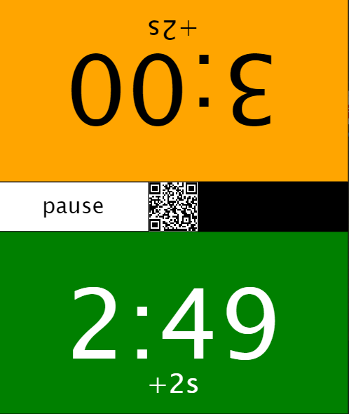
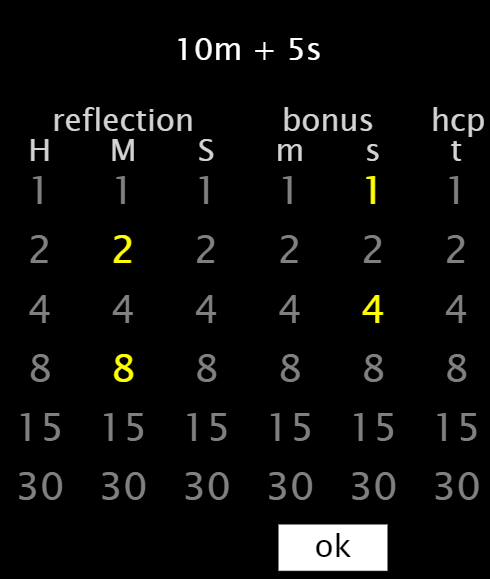

# 2022-007-StateLab

## Chess clock
* Click on any player to start
* Clicking **pause** will display the **new** button



## Settings
* Choose hours, minutes and seconds using columns **H**, **M** and **S**
* Optionally, choose bonus time, minutes and seconds, using columns **m** and **s**
* Also optionally, choose a handicap using column **t**



## How to enter numbers
```
1
2
3 = 1 + 2
4
5 = 1 + 4
6 = 2 + 4
7 = 1 + 2 + 4
8
9 = 1 + 8
10 = 2 + 8
11 = 1 + 2 + 8
12 = 4 + 8
13 = 1 + 4 + 8
14 = 2 + 4 + 8
15
..
59 = 2 + 4 + 8 + 15 + 30

```

## Handicap system
* No handicap is default
* The handicap is based on sixtieths, 0/60 to 60/60
* The total game time is the same, before and after the handicap
* If you want to relate ELO difference to sixtieths, use a separate table or formula, as there are several alternatives

### Example:
* You have decided on a game using 10m + 5s, and would like to give away 5m to the other player
* Using 5m/10m = 30/60, the adjusted times will be 5m + 2.5s and 15m + 7.5s

### The QR code
* Contains the URL for the application
* Use your camera or QR reader app
* Optimized for Android

### Definitions
* reflection = the time you have left
* bonus = time that will be added for every move. (Fischer System)
* hcp = handicap. Expressed in sixtieths (1/60)
* swap = When using handicap, swaps the times for the players
* h = hour 0 .. 60
* m = minute 0 .. 60
* s = second 0 .. 60
* t = handicap 0 .. 60

### Repeat Game
* Click **pause**
* Click **new**
* Click **ok**
* Click one of the players to start

### Pause the clock
* Click **pause**
* Click **continue**

### Go to Settings
* Click **new**
* Choose numbers
* Click **ok**