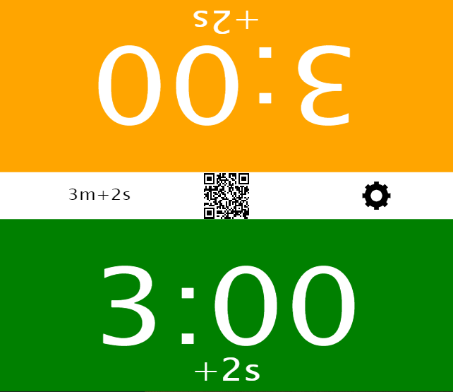
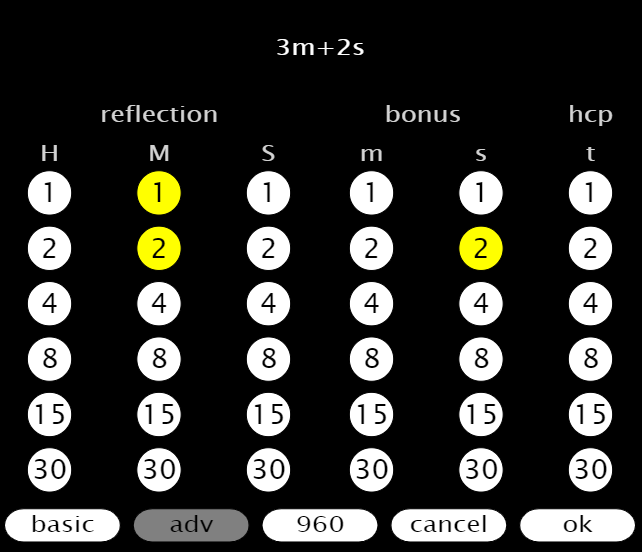
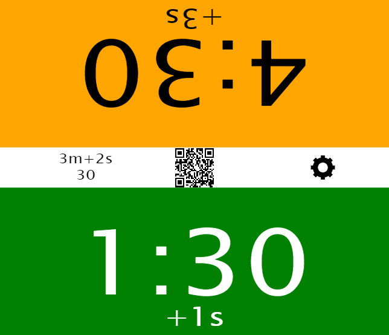

# Fischer Chess Clock with Handicap and Chess 960
* Click on any player to start, that is the green or orange button

### Pause the clock
* Click *pause*
* Click any player to continue

### New game
* Click *pause*
* Click *cog wheel*
* Click **ok**
* Click any player to start



Clicking  will display the  button

## Basic Settings

* Choose reflection and bonus times
* Click *adv* to choose times between 60 hours and one second, as well as handicap
* Click *960* to choose a Chess960 starting configuration
* Click *ok* to start play

## Advanced Settings

* Choose reflection and bonus times. hours, minutes and seconds using columns **H**, **M** and **S**
* Optionally, choose bonus time, minutes and seconds, using columns **m** and **s**
* Also optionally, choose a handicap using column **t**
* Click *basic* to return to Basic Settings
* Click *960* to choose a Chess960 starting configuration
* Click *ok* to start play

## How to enter numbers in Advanced Settings
```
1
2
3 = 1 + 2
4
5 = 1 + 4
6 = 2 + 4
7 = 1 + 2 + 4
8
9 = 1 + 8
10 = 2 + 8
11 = 1 + 2 + 8
12 = 4 + 8
13 = 1 + 4 + 8
14 = 2 + 4 + 8
15
..
59 = 2 + 4 + 8 + 15 + 30
```

## Handicap system
* The handicap is based on sixtieths, 0/60 to 59/60. (60/60 gives zero time to the stronger player)
* The total game time is the same, before and after the handicap

### Example:
* You have decided on a game using 3m + 2s, and would like to give away half of your time to the other player
* Choosing the handicap 30/60, the adjusted times will be 4m30s + 3s and 1m30s + 1s
* Please note, the total time is still 6m + 4s

### Handicap Settings


### The resulting times



### How to use ratings to set handicap

* Divide the difference by a number, e.g. 20
	* Difference=0 => handicap 0
	* Difference=160 => handicap 8
	* Difference=200 => handicap 10
	* Difference=1200 => handicap 59 (maximum)

### How to find a handicap between two persons
1. Start with handicap 0
1. Play a game with your friend until someone wins
1. Adjust the handicap with first 30, then 15, then 8, 4, 2, 1, 1 and so on
1. Repeat from step 2 until the handicap is stable

```
Example:
handicap   result
0
           Stronger wins
0+30 = 30
           S 
30+15 = 45
           Weaker wins
45-8 = 37
           S
37+4 = 41
           W
41-2 = 39
           W
39-1 = 38
```
### Handicap quotas
```
w = Weaker player time
s = Stronger player time

HCP w/s         HCP w/s        HCP w/s
 0  1           20  2          40  5
 1  1.034       21  2.077      41  5.316
 2  1.069       22  2.158      42  5.667
 3  1.105       23  2.243      43  6.059
 4  1.143       24  2.333      44  6.5
 5  1.182       25  2.429      45  7
 6  1.222       26  2.529      46  7.571
 7  1.264       27  2.636      47  8.231
 8  1.308       28  2.75       48  9
 9  1.353       29  2.871      49  9.909
10  1.4         30  3          50  11
11  1.449       31  3.138      51  12.333
12  1.5         32  3.286      52  14
13  1.553       33  3.444      53  16.143
14  1.609       34  3.615      54  19
15  1.667       35  3.8        55  23
16  1.727       36  4          56  29
17  1.791       37  4.217      57  39
18  1.857       38  4.455      58  59
19  1.927       39  4.714      59  119
```

### The QR code
* Contains the URL for the application
* Use your camera or QR reader app
* Optimized for Android

### Definitions
* reflection = the time you have left
* bonus = time that will be added for every move. (Fischer System)
* hcp = handicap. Expressed in sixtieths (1/60)
* h = hour: 0 to 59
* m = minute: 0 to 59
* s = second: 0 to 59
* t = handicap: 0 to 59

### Chess 960

[Fischer Random Chess](https://en.wikipedia.org/wiki/Fischer_random_chess)


* The randomly positioned chess pieces fulfill Chess 960 rules
	* Bishops must be on *different* colour squares
	* King must be *between* the rooks and will castle to file c or g, as in normal chess
* Press **random** or specify an ID using the number buttons
	* [Chess960 Rules](https://lichess.org/variant/chess960)
	* [Chess960 starting positions](https://chess960.net/wp-content/uploads/2018/02/chess960-starting-positions.pdf)
* Click *basic* to return to Basic Settings
* Click *adv* to choose times between 60 hours and one second, as well as handicap
* Click *ok* to start play

### Hidden feature
* Clicking QR makes the screen full size on Android and Windows