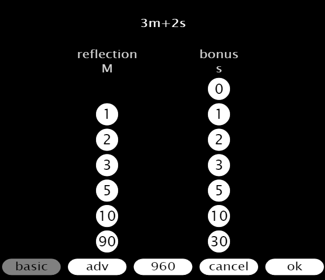

# Chess clock with handicaps
* Click on any player to start, that is the green or orange button
* Clicking  will display the  button


## Settings
* Choose hours, minutes and seconds using columns **H**, **M** and **S**
* Optionally, choose bonus time, minutes and seconds, using columns **m** and **s**
* Also optionally, choose a handicap using column **t**



## How to enter numbers
```
1
2
3 = 1 + 2
4
5 = 1 + 4
6 = 2 + 4
7 = 1 + 2 + 4
8
9 = 1 + 8
10 = 2 + 8
11 = 1 + 2 + 8
12 = 4 + 8
13 = 1 + 4 + 8
14 = 2 + 4 + 8
15
..
59 = 2 + 4 + 8 + 15 + 30
```

## Handicap system
* The handicap is based on sixtieths, 0/60 to 59/60. (60/60 gives zero time to the stronger player)
* The total game time is the same, before and after the handicap

### Example:
* You have decided on a game using 3m + 2s, and would like to give away a quarter of your time to the other player
* Choosing the handicap 15/60, the adjusted times will be 3m45s + 2.5s and 2m15s + 1.5s
* Please note, the total time is still 6m + 4s

### Handicap Settings


### The resulting times


### How to find a handicap between two persons
1. Start with handicap 0
1. Play a game with your friend until someone wins
1. Adjust the handicap with first 30, then 15, then 8, 4, 2, 1, 1 and so on
1. Repeat from step 2 until the handicap is stable

### Handicap quotas
```
w = Weaker player time
s = Stronger player time

HCP w/s
 0  1
 1  1.034
 2  1.069
 3  1.105
 4  1.143
 5  1.182
 6  1.222
 7  1.264
 8  1.308
 9  1.353
10  1.4
11  1.449
12  1.5
13  1.553
14  1.609
15  1.667
16  1.727
17  1.791
18  1.857
19  1.927
20  2
21  2.077
22  2.158
23  2.243
24  2.333
25  2.429
26  2.529
27  2.636
28  2.75
29  2.871
30  3
31  3.138
32  3.286
33  3.444
34  3.615
35  3.8
36  4
37  4.217
38  4.455
39  4.714
40  5
41  5.316
42  5.667
43  6.059
44  6.5
45  7
46  7.571
47  8.231
48  9
49  9.909
50  11
51  12.333
52  14
53  16.143
54  19
55  23
56  29
57  39
58  59
59  119
```

### The QR code
* Contains the URL for the application
* Use your camera or QR reader app
* Optimized for Android

### Definitions
* reflection = the time you have left
* bonus = time that will be added for every move. (Fischer System)
* hcp = handicap. Expressed in sixtieths (1/60)
* h = hour: 0 to 60
* m = minute: 0 to 60
* s = second: 0 to 60
* t = handicap: 0 to 59

### New game
* Click *pause*
* Click *cog wheel*
* Click **ok**
* Click one of the players to start

### Pause the clock
* Click *pause*
* Click any player to continue

